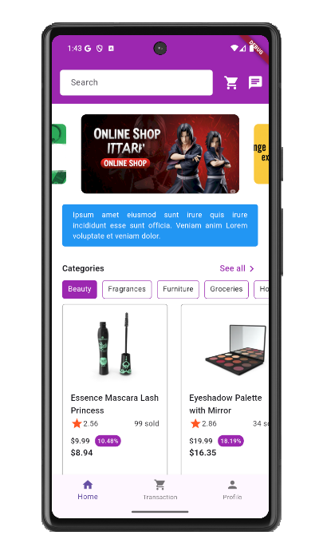
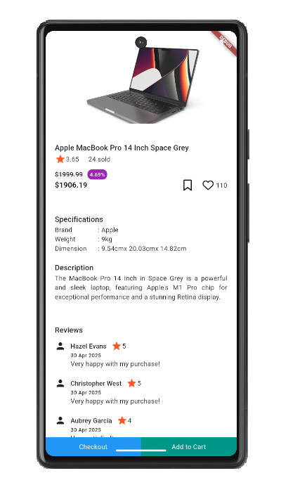
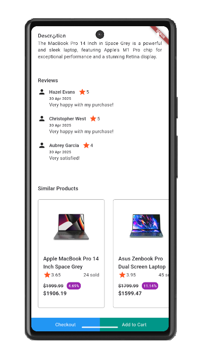

# Nge Shop

An "eCommerce" app.

There are several libraries used in this app, like: 

<table>
  <thead>
    <tr>
      <th>Library</th>
      <th>Description</th>
    </tr>
    <tr>
      <td>provider</td>
      <td>State management.</td>
    </tr>
    <tr>
      <td>go_router</td>
      <td>Routing/navigation.</td>
    </tr>
    <tr>
      <td>firebase_core</td>
      <td>Core library for firebase.</td>
    </tr>
    <tr>
      <td>firebase_auth & google_sign_in</td>
      <td>Used for authentication with google.</td>
    </tr>
    <tr>
      <td>firebase_remote_config</td>
      <td>Read data from firebase remote config</td>
    </tr>
    <tr>
      <td>hive</td>
      <td>Local database</td>
    </tr>
    <tr>
      <td colspan="2">and more (see pubspec.yaml)</td>
    </tr>
  </thead>
</table>

These are several screens and it explanation:

<ul>
  <li>
    <b>Splash</b>
    
Show splash screen for several seconds, then go to onboarding page.

    
  </li>
  <li>
    <b>Login</b>
    
Check first if user token exist then auto redirect to dashboard page. If not yet, show login page, then show pop up "Login with Google".

    
  </li>
  <li>
    <b>Dashboard</b>
    
There are 3 main features here: home, transaction, and profile. User can go to each page using bottom navigation. In home, user can see carousel, information, and show product list by category.

    
  </li>
  <li>
    <b>Product</b>
    
Show product's detail

    
    
  </li>
  <li>
    <b>Cart</b>
    
When user click "Add to Cart" button to a product both from home page product list or product detail, it will auto add number of cart in the app bar. If click it icon, will show page like this:

    
  </li>
  <li>
    <b>Transaction</b>
    
Show list of transaction This still in static data.

    
  </li>
  <li>
    <b>Profile</b>
    
Show profile data.

    
  </li>
</ul>